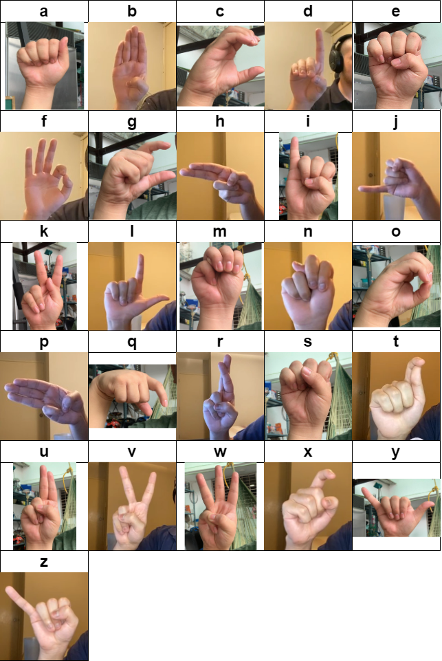

## **Online Realtime Venezuelan Sign Language Translator** 

##### [Try it out!](https://traductor-lsv.web.app/)

This is a undergraduate thesis project for the degree of Systems Engineering at the [Metropolitan University of Caracas](https://www.google.com/search?q=Universidad+Metropolitana+de+Caracas) by [Daniel Ignacio Montilla](https://github.com/DanielMontilla) and Kevin Han with academic tutor Antonio Maximiliano Guerra Telleria. This thesis has been completed and accepted 🎉

### How did we make it?
We used [MediaPipe](https://developers.google.com/mediapipe) to capture our hand landmarks and [Tensorflow](https://www.tensorflow.org/) to interpret the incoming position and subsequently assign a probability for a given sign in the alphabet. For our online, we used [Vuejs](https://vuejs.org/) and [Firebase Hosting](https://firebase.google.com/docs/hosting)

### Train your own model

##### Prerequisites
- Download and install [python **≥3.9v**](https://www.python.org/)
- Download and install [conda](https://docs.conda.io/en) or [miniconda](https://docs.conda.io/en/latest/miniconda.html) (recommended)
- Download and install [Nodejs](https://nodejs.org/en)
- A webcam or other camera device
##### Instructions
1. Create python virtual environment with [conda](https://docs.conda.io/en/latest/miniconda.html) `conda create -n lsv python=3.9`
2. Activate virtual environment: `conda activate lsv`
3. For GPU support:
	`conda install -c conda-forge cudatoolkit=11.2 cudnn=8.1.0`
4. Upgrade `pip`: `pip install --upgrade pip`
5. Install local dependencies: `pip install "tensorflow<2.11" opencv-python mediapipe scikit-learn ipykernel tensorflowjs`. To verify package versions check the [dependency list](#dependency-list)
6. Open `workspace/main.ipynb` jupyter notebook
7. Collect your own training data ([or use ours](https://drive.google.com/drive/folders/1ICxlq-nFmuEE-t2ZIOrG6Gk2SCd1G9mG?usp=sharing))
	- (optional) take photos using the `Image Collection & Preprocessing` section
8. Train by running the cells on the `Training` section
	- (optional) monitor model performance with `tensorboard`. 
9. Export model running the `Export` cell and place file on `app/public/model` folder
10. Run `npm install` and `npm run dev` to test out the model!

---
## **Traductor Online en tiempo real del Lenguaje de Señas Venezolano 

##### [¡Pruébalo!](https://traductor-lsv.web.app/)

Este es un proyecto de tesis de pregrado para el título de Ingeniería de Sistemas en la [Universidad Metropolitana de Caracas](https://www.google.com/search?q=Universidad+Metropolitana+de+Caracas) realizado por [Daniel Ignacio Montilla](https://github.com/DanielMontilla) y Kevin Han con tutor académico Antonio Maximiliano Guerra Telleria. Esta tesis ha sido completada y aceptada 🎉
### ¿Cómo lo hicimos?
Utilizamos [MediaPipe](https://developers.google.com/mediapipe) para capturar las marcas de nuestras manos y [Tensorflow](https://www.tensorflow.org/) para interpretar la posición entrante y posteriormente asignar una probabilidad para un signo dado en el alfabeto. Para nuestra aoo, utilizamos [Vuejs](https://vuejs.org/) y [Firebase Hosting](https://firebase.google.com/docs/hosting)

### Entrena tu propio modelo

##### Prerrequisitos
- Descarga e instala [python **≥3.9v**](https://www.python.org/)
- Descarga e instala [conda](https://docs.conda.io/en) o [miniconda](https://docs.conda.io/en/latest/miniconda.html) (recomendado)
- Descarga e instala [Nodejs](https://nodejs.org/en)
- Una cámara web u otro dispositivo de cámara
##### Instrucciones
1. Crea un entorno virtual de python con [conda](https://docs.conda.io/en/latest/miniconda.html) `conda create -n lsv python=3.9`
2. Activa el entorno virtual: `conda activate lsv`
3. Para soporte de GPU:
	`conda install -c conda-forge cudatoolkit=11.2 cudnn=8.1.0`
4. Actualiza `pip`: `pip install --upgrade pip`
5. Instala las dependencias locales: `pip install "tensorflow<2.11" opencv-python mediapipe scikit-learn ipykernel tensorflowjs`. Para verificar las versiones de los paquetes, consulta la [lista de dependencias](#lista-de-dependencias)
6. Abre el cuaderno `workspace/main.ipynb` de jupyter
7. Recopila tus propios datos de entrenamiento ([o utiliza los nuestros](https://drive.google.com/drive/folders/1ICxlq-nFmuEE-t2ZIOrG6Gk2SCd1G9mG?usp=sharing))
	- (opcional) toma fotos usando la sección `Recolección de imágenes y preprocesamiento`
8. Entrena ejecutando las celdas en la sección `Entrenamiento`
	- (opcional) monitorea el rendimiento del modelo con `tensorboard`.
9. Exporta el modelo ejecutando la celda `Exportar` y coloca el archivo en la carpeta `app/public/model`
10. Ejecuta `npm install` y `npm run dev` para probar el modelo.

#### Dependency List
| Package Name                   | Version    |
|-------------------------------|------------|
| absl-py                       | 1.4.0      |
| asttokens                     | 2.2.1      |
| astunparse                    | 1.6.3      |
| attrs                         | 22.2.0     |
| backcall                      | 0.2.0      |
| cachetools                    | 5.3.0      |
| certifi                       | 2022.12.7  |
| charset-normalizer            | 3.1.0      |
| colorama                      | 0.4.6      |
| comm                          | 0.1.3      |
| contourpy                     | 1.0.7      |
| cycler                        | 0.11.0     |
| debugpy                       | 1.6.7      |
| decorator                     | 5.1.1      |
| executing                     | 1.2.0      |
| flatbuffers                   | 23.3.3     |
| fonttools                     | 4.39.3     |
| gast                          | 0.4.0      |
| google-auth                   | 2.17.2     |
| google-auth-oauthlib          | 0.4.6      |
| google-pasta                  | 0.2.0      |
| grpcio                        | 1.53.0     |
| h5py                          | 3.8.0      |
| idna                          | 3.4        |
| importlib-metadata            | 6.2.0      |
| importlib-resources           | 5.12.0     |
| ipykernel                     | 6.22.0     |
| ipympl                        | 0.9.3      |
| ipython                       | 8.12.0     |
| ipython-genutils              | 0.2.0      |
| ipywidgets                    | 8.0.6      |
| jedi                          | 0.18.2     |
| joblib                        | 1.2.0      |
| jupyter_client                | 8.1.0      |
| jupyter_core                  | 5.3.0      |
| jupyterlab-widgets            | 3.0.7      |
| keras                         | 2.10.0     |
| Keras-Preprocessing           | 1.1.2      |
| kiwisolver                    | 1.4.4      |
| libclang                      | 16.0.0     |
| Markdown                      | 3.4.3      |
| MarkupSafe                    | 2.1.2      |
| matplotlib                    | 3.7.1      |
| matplotlib-inline             | 0.1.6      |
| mediapipe                     | 0.9.1.0    |
| nest-asyncio                  | 1.5.6      |
| numpy                         | 1.24.2     |
| oauthlib                      | 3.2.2      |
| opencv-contrib-python         | 4.7.0.72   |
| opencv-python                 | 4.7.0.72   |
| opt-einsum                    | 3.3.0      |
| packaging                     | 20.9       |
| parso                         | 0.8.3      |
| pickleshare                   | 0.7.5      |
| Pillow                        | 9.5.0      |
| pip                           | 23.0.1     |
| platformdirs                  | 3.2.0      |
| prompt-toolkit                | 3.0.38     |
| protobuf                      | 3.19.6     |
| psutil                        | 5.9.4      |
| pure-eval                     | 0.2.2      |
| pyasn1                        | 0.4.8      |
| pyasn1-modules                | 0.2.8      |
| Pygments                      | 2.14.0     |
| pyparsing                     | 3.0.9      |
| python-dateutil               | 2.8.2      |
| pywin32                       | 306        |
| pyzmq                         | 25.0.2     |
| requests                      | 2.28.2     |
| requests-oauthlib             | 1.3.1      |
| rsa                           | 4.9        |
| scikit-learn                  | 1.2.2      |
| scipy                         | 1.10.1     |
| setuptools                    | 65.6.3     |
| six                           | 1.16.0     |
| stack-data                    | 0.6.2      |
| tabulate                      | 0.9.0      |
| tensorboard                   | 2.10.1     |
| tensorboard-data-server       | 0.6.1      |
| tensorboard-plugin-wit        | 1.8.1      |
| tensorflow                    | 2.10.1     |
| tensorflow-estimator          | 2.10.0     |
| tensorflow-hub                | 0.12.0     |
| tensorflow-io-gcs-filesystem  | 0.31.0     |
| tensorflowjs                  | 3.18.0     |
| termcolor                     | 2.2.0      |
| threadpoolctl                 | 3.1.0      |
| tornado                       | 6.2        |
| traitlets                     | 5.9.0      |
| typing_extensions             | 4.5.0      |
| urllib3                       | 1.26.15    |
| wcwidth                       | 0.2.6      |
| Werkzeug                      | 2.2.3      |
| wheel                         | 0.38.4     |
| widgetsnbextension            | 4.0.7      |
| wincertstore                  | 0.2        |
| wrapt                         | 1.15.0     |
| zipp                          | 3.15.0     |
